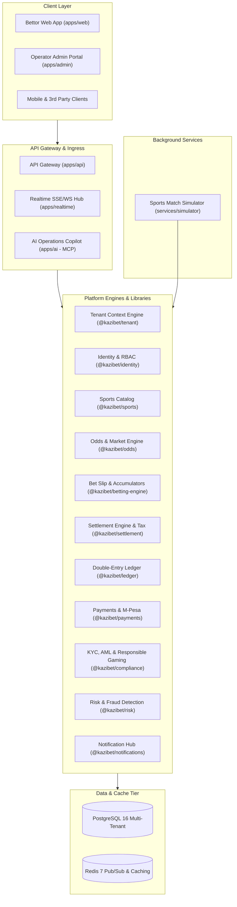

# KaziBet — Production-Grade Multi-Tenant Sports Betting Platform OS

[](https://github.com/MosetiReagan/KaziBet/actions/workflows/ci.yml)
[](#license)
[](#multi-tenancy--isolation-model)
[](#immutable-double-entry-financial-ledger)
[](#regulatory-compliance--responsible-gaming)
[](#model-context-protocol-mcp-ai-copilot)

**KaziBet** is an open-source, enterprise-grade, multi-tenant Sportsbook Platform OS engineered for licensed betting operators and white-label platforms.

Unlike basic betting prototypes or monolithic gambling scripts, KaziBet is architected as a mission-critical financial and event-driven platform:
- **Sandbox-First Capability Model**: Real-money deposits, withdrawals, and wagers are disabled by default and locked behind explicit multi-step production/compliance certifications.
- **Strict Multi-Tenant Isolation**: Hard isolation of tenant data across databases, cache keys, events, and API boundaries.
- **Double-Entry Financial Ledger**: Immutable journal entries where $\sum \text{Debits} == \sum \text{Credits}$ across all financial events. Wallet balances are derived from ledger lines rather than mutable raw columns.
- **Kenya BCLB & Tax Reference**: Pre-configured for Kenyan betting regulations, including real-time 20% withholding tax (WHT) deduction remitted to the Kenya Revenue Authority (KRA), KYC tiers, and AML sanctions screening.
- **Model Context Protocol (MCP) AI Copilot**: Native integration with AI agents for automated ledger auditing, risk monitoring, odds adjustment, and emergency market suspension with RBAC guards.

---

## Table of Contents

- [Package Implementation Status](#package-implementation-status)
- [System Architecture](#system-architecture)
- [Repository Structure & Packages](#repository-structure--packages)
- [Core Platform Guarantees](#core-platform-guarantees)
  - [1. Sandbox-First Capability State Machine](#1-sandbox-first-capability-state-machine)
  - [2. Multi-Tenancy & Isolation Model](#2-multi-tenancy--isolation-model)
  - [3. Immutable Double-Entry Financial Ledger](#3-immutable-double-entry-financial-ledger)
  - [4. Betting Engine & Live Settlement](#4-betting-engine--live-settlement)
  - [5. Regulatory Compliance & Responsible Gaming](#5-regulatory-compliance--responsible-gaming)
  - [6. Model Context Protocol (MCP) AI Copilot](#6-model-context-protocol-mcp-ai-copilot)
- [Quickstart Guide](#quickstart-guide)
  - [Prerequisites](#prerequisites)
  - [Installation & Build](#installation--build)
  - [Running the Services](#running-the-services)
- [CLI Tool Reference (`kazibet`)](#cli-tool-reference-kazibet)
- [Docker & Kubernetes Deployment](#docker--kubernetes-deployment)
- [Testing & Verification](#testing--verification)
  - [Running Unit & Integration Tests](#running-unit--integration-tests)
  - [Section 53 End-to-End Lifecycle Verification](#section-53-end-to-end-lifecycle-verification)
- [API Reference](#api-reference)
- [Contributing & License](#contributing--license)

---

## Package Implementation Status

| Package / Application | Directory | Status | Notes |
|---|---|:---:|---|
| **Core Domain Types** | `packages/shared` | **Done** | Domain entities, Money value object, events, error taxonomy |
| **Configuration** | `packages/config` | **Done** | Schema validator, Kenya defaults, strict JWT secret enforcement |
| **Database & Repos** | `packages/database` | **Done** | Prisma-backed PostgreSQL repositories, row-level locking (`SELECT ... FOR UPDATE`), Redis locks, migrations, in-memory fallback |
| **Tenant Context** | `packages/tenant` | **Done** | Context holder (`AsyncLocalStorage`), isolation engine, state machine |
| **Identity & RBAC** | `packages/identity` | **Done** | User registration, bcrypt hashing, JWT auth, RBAC permissions, RFC 6238 TOTP 2FA, single-use backup codes |
| **REST API Gateway** | `apps/api` | **Done** | REST gateway, tenant routing, auth, sliding window rate limiting, Helmet security headers, CORS domain checks, 1MB/10MB limits |
| **Sports Catalog & Feeds** | `packages/sports` | **Done** | Fixtures, sports catalog, The Odds API provider (live & replay mode), simulator fallback, stale market auto-suspension |
| **Odds Engine** | `packages/odds` | **Partial** | Margins, versioning, suspension; awaiting live external feed updates |
| **Betting Engine** | `packages/betting-engine` | **Done** | Slip valuation, accumulators, anti-correlation, wallet hold, wagering bonus engine (rollover, expiration, free bets) |
| **Sports Simulator** | `services/simulator` | **Simulated** | Background synthetic match clock, goal generator, and odds fluctuations |
| **Financial Ledger** | `packages/ledger` | **Done** | Double-entry journal engine, immutable lines, zero-sum balance auditor |
| **Payments & M-Pesa** | `packages/payments` | **Done** | Full Safaricom Daraja STK push & B2C, OAuth caching, unguessable callback tokens, IP allowlisting, sweeper, statement CSV reconciliation |
| **Settlement Engine** | `packages/settlement` | **Done** | Deterministic 1X2, Double Chance (1X/X2/12), Draw No Bet, Asian handicap (half-win/half-loss/push), dead heat, 20% WHT, early cashout, immutable resettlement with reversals |
| **Compliance & KYC** | `packages/compliance` | **Done** | Tiered KYC, Smile Identity adapter, Kenya ID/Passport regex validation, M-Pesa fuzzy name matching, Soundex UN/OFAC sanctions & PEP screening |
| **Risk & Fraud** | `packages/risk` | **Done** | Stake surge, velocity checks, liability tracking, automated exposure ceilings, multi-account device/IP/payment linking |
| **Notifications Hub** | `packages/notifications` | **Simulated** | Multi-channel dispatcher with mock sandbox provider |
| **Realtime Gateway** | `apps/realtime` | **Done** | SSE & WebSocket hub with tenant-scoped channel pub/sub |
| **Rules & Analytics** | `packages/rules` | **Done** | GGR/NGR calculations, turnover metrics, CMS theme resolution |
| **AI Copilot (MCP)** | `apps/ai` | **Done** | Model Context Protocol server, RBAC-guardrailed operational tools |
| **UI Components** | `packages/ui` | **Done** | Design tokens, odds buttons, slip widgets, badge components |
| **Bettor Web App** | `apps/web` | **Done** | Connected to API & realtime SSE, working bet slip, 20% WHT math, M-Pesa cashier, My Bets & cashout |
| **Operator Admin Portal** | `apps/admin` | **Partial** | HTML/REST operational dashboard for trading, settlement, copilot |
| **CLI Administration** | `packages/cli` | **Done** | Unified `kazibet` tool for provisioning, seeding, diagnostics, backup |
| **Observability** | `packages/observability` | **Done** | Structured logger, latency tracker, Prometheus metrics format |
| **Kenya Localization** | `packages/kenya` | **Done** | USSD betting state machine (*123#), SMS betting parser (team aliases, accumulators, balance, cashout), 160-char screen enforcement |

---

## System Architecture



---

## Repository Structure & Packages

This repository is structured as a high-performance **pnpm monorepo**:

```
.
├── apps/
│   ├── admin/                  # White-label operator portal (trading, settlement, analytics)
│   ├── ai/                     # Model Context Protocol (MCP) server & AI operations copilot
│   ├── api/                    # Core REST API Gateway with tenant routing & middleware
│   ├── realtime/               # WebSocket and Server-Sent Events (SSE) live sports hub
│   └── web/                    # Responsive public sportsbook UI with dynamic bet slip
├── packages/
│   ├── betting-engine/         # Slip valuation, accumulator calculation, idempotency
│   ├── cli/                    # Unified 'kazibet' CLI administrative tool
│   ├── compliance/             # KYC verification, AML sanctions screening, self-exclusion
│   ├── config/                 # Tenant configuration schema, Kenya reference defaults
│   ├── database/               # Prisma relational schema, models, transactional repositories
│   ├── identity/               # Registration, bcrypt hashing, JWT, RBAC guards
│   ├── ledger/                 # Immutable double-entry journal engine with balance auditing
│   ├── notifications/          # Multi-channel notification engine (SMS, push, email, mock)
│   ├── observability/          # Structured logging, latency metrics, Prometheus exporter
│   ├── odds/                   # Odds computation, optimistic versioning, market suspension
│   ├── payments/               # Provider abstraction, M-Pesa adapter, webhook HMAC validation
│   ├── risk/                   # Fraud anomaly detection, stake surges, velocity checks
│   ├── rules/                  # Financial analytics (GGR/NGR), CMS white-label theme resolver
│   ├── settlement/             # Deterministic market settlement, cashout, 20% WHT calculation
│   ├── shared/                 # Domain types, Money value object, events, error primitives
│   ├── sports/                 # Event scheduling, score updates, sport catalog lifecycle
│   ├── tenant/                 # Multi-tenant context holder, isolation engine, state transitions
│   └── ui/                     # Design tokens, odds buttons, slip elements, status badges
├── services/
│   └── simulator/              # Match clock, goal events, odds surge generator
├── infrastructure/
│   ├── docker/                 # Dockerfiles for all microservices and apps
│   ├── kubernetes/             # Production deployment, service, and ingress manifests
│   └── terraform/              # Cloud infrastructure as code definitions
├── docs/                       # Architectural specs, ledger design, database schemas, threat models
├── tests/                      # Section 53 full 18-step end-to-end integration lifecycle test
├── docker-compose.yml          # Complete local sandbox orchestration stack
├── package.json                # Monorepo root manifest
└── pnpm-workspace.yaml         # Workspace package declarations
```

---

## Core Platform Guarantees

### 1. Sandbox-First Capability State Machine
Tenants begin in `SANDBOX` mode. Real-money wagering, live payment gateways, and external fund movements are strictly blocked at the domain layer until the operator passes compliance verification:
```
  ┌───────────┐      Submit Legal & Tax Docs      ┌──────────────────────┐
  │  SANDBOX  │ ─────────────────────────────────>│  PRODUCTION_PENDING  │
  └───────────┘                                   └──────────┬───────────┘
                                                             │
                                                             │ Verification Passed
                                                             ▼
  ┌───────────┐       Operator Go-Live Trigger    ┌──────────────────────┐
  │ SUSPENDED │<──────────────────────────────────│ PRODUCTION_APPROVED  │
  └─────┬─────┘                                   └──────────┬───────────┘
        │                                                    │
        │                                                    │ Activate Live Operations
        │                                                    ▼
        │                                         ┌──────────────────────┐
        └────────────────────────────────────────>│  PRODUCTION_ACTIVE   │
               Emergency Regulatory Freeze        └──────────────────────┘
```

### 2. Multi-Tenancy & Isolation Model
- **Context Holder**: Backed by Node.js `AsyncLocalStorage`. The active tenant context is injected at the gateway middleware from domain headers or JWT claims.
- **Fail-Closed Isolation**: Attempting to query, mutate, lock, or access any entity outside the active context throws a non-bypassable `TenantIsolationError`.
- **Database Partitioning**: Tenant IDs are required on every row and indexed for high-concurrency multi-tenant query plans.

### 3. Immutable Double-Entry Financial Ledger
Every monetary transaction is recorded as an immutable set of debit and credit lines:
- **Zero-Sum Balance Invariant**:
  $$\sum \text{Debits} == \sum \text{Credits}$$
- **Hold & Release Lifecycle**:
  1. **Bet Placement**: Moves stake from Available to Hold:
     - `DR User Hold` / `CR User Available`
  2. **Winning Bet Settlement**:
     - `DR User Hold` + `DR Gaming Payout Expense` == `CR User Available` + `CR Tax Withholding (KRA)`
  3. **Losing Bet Settlement**:
     - `DR Gaming Revenue` / `CR User Hold`
- **Reconciliation Engine**: Ingests external bank/M-Pesa statements and executes automated matching with discrepancy flagging.

### 4. Betting Engine & Live Settlement
- **Bet Types**: Singles, Accumulators (Multi-bets), System Bets.
- **Anti-Correlation**: Automatically validates and rejects accumulator slips containing correlated selections from the same sporting event.
- **Optimistic Versioning**: All odds carry a monotonic version counter. Bets placed on stale odds are rejected with `ODDS_CHANGED` error codes.
- **Live Cashout**: Fair present-value cashout algorithm adjusting for live odds movement and bookmaker margins.

### 5. Regulatory Compliance & Responsible Gaming
- **Kenya BCLB Reference**: Includes Kenya Betting Control and Licensing Board default rule packs.
- **Withholding Tax (WHT)**: Automatically computes and deducts 20% tax on net winnings (gross payout minus stake), crediting the platform's tax withholding liability account.
- **KYC Tiers**:
  - **Tier 1** (Unverified): Daily stake capped at 10,000 KES.
  - **Tier 2** (Verified ID): Daily stake capped at 70,000 KES.
  - **Tier 3** (Enhanced Due Diligence): Full enterprise limits.
- **Responsible Gaming Controls**: Configurable daily deposit limits, mandatory cooling-off periods, and instant self-exclusion with account freeze.

### 6. Model Context Protocol (MCP) AI Copilot
KaziBet features a built-in AI copilot operating via the Model Context Protocol:
- **`kazibet_audit_ledger`**: Audits mathematical zero-sum ledger invariants across all tenant accounts.
- **`kazibet_suspend_market`**: Emergency circuit-breaker tool for traders to freeze markets during unexpected match events or odds volatility.
- **`kazibet_query_metrics`**: Summarizes Gross Gaming Revenue (GGR), Net Gaming Revenue (NGR), and active bettor turnover.
- **`kazibet_adjust_odds`**: Modifies market prices with mandatory trader audit logging.

---

## Quickstart Guide

### Prerequisites
- **Node.js**: `v20.x` or `v22.x+`
- **pnpm**: `v9.x` or `v10.x`
- **Docker & Docker Compose** (for running Postgres, Redis, and services)

### Installation & Build

1. **Clone the repository**:
   ```bash
   git clone https://github.com/MosetiReagan/KaziBet.git
   cd KaziBet
   ```

2. **Install dependencies**:
   ```bash
   pnpm install
   ```

3. **Build all packages and applications**:
   ```bash
   pnpm -r build
   ```

4. **Initialize Environment Configuration**:
   ```bash
   cp .env.example .env
   ```

### Running the Services

#### Option A: Docker Compose (Recommended)
Spins up PostgreSQL, Redis, API Gateway, Realtime Hub, Match Simulator, AI Copilot, Web App, and Admin Portal:
```bash
docker compose up -d
```

Service endpoints:
- **API Gateway**: `http://localhost:4000` (Health check: `http://localhost:4000/health`)
- **Bettor Web App**: `http://localhost:3000`
- **Operator Admin Portal**: `http://localhost:3001`
- **Realtime SSE/WebSocket**: `http://localhost:4001`
- **AI Operations Copilot (MCP)**: `http://localhost:4002`

#### Option B: Running Locally with pnpm
Run individual services in development mode:
```bash
# Start API Gateway
pnpm --filter @kazibet/api dev

# Start Bettor Web Application
pnpm --filter @kazibet/web dev

# Start Operator Admin Portal
pnpm --filter @kazibet/admin dev

# Start Live Match Simulator
pnpm --filter @kazibet/simulator start
```

---

## CLI Tool Reference (`kazibet`)

The repository includes the `@kazibet/cli` package for DevOps, tenant management, and platform administration:

```bash
# Display general help
pnpm --filter @kazibet/cli start --help

# Run platform system diagnostics
pnpm --filter @kazibet/cli start doctor

# Provision a new tenant
pnpm --filter @kazibet/cli start tenant create \
  --slug "safari-bet" \
  --name "Safari Sports Bet" \
  --currency "KES" \
  --country "KE"

# List existing tenants
pnpm --filter @kazibet/cli start tenant list

# Seed reference sports catalog and mock matches
pnpm --filter @kazibet/cli start seed --tenant "tenant_ke_default"

# Trigger hot backup of tenant financial ledger
pnpm --filter @kazibet/cli start backup --tenant "tenant_ke_default"
```

---

## Docker & Kubernetes Deployment

### Docker Containers
Multi-stage production Dockerfiles are located in [`infrastructure/docker/`](infrastructure/docker):
```bash
docker build -t kazibet/api:latest -f infrastructure/docker/Dockerfile.api .
docker build -t kazibet/web:latest -f infrastructure/docker/Dockerfile.web .
docker build -t kazibet/admin:latest -f infrastructure/docker/Dockerfile.admin .
```

### Kubernetes Manifests
Standard Kubernetes deployment, service, and ingress manifests are available in [`infrastructure/kubernetes/`](infrastructure/kubernetes):
```bash
kubectl apply -f infrastructure/kubernetes/deployment.yaml
kubectl apply -f infrastructure/kubernetes/ingress.yaml
```

### Terraform Infrastructure as Code
Provision cloud infrastructure (VPC, Managed PostgreSQL, Elasticache Redis, Kubernetes clusters) using Terraform in [`infrastructure/terraform/`](infrastructure/terraform):
```bash
cd infrastructure/terraform
terraform init
terraform plan
```

---

## Testing & Verification

### Running Unit & Integration Tests
Execute test suites across all 24 workspace projects:
```bash
pnpm -r test
```

### Section 53 End-to-End Lifecycle Verification
Execute the comprehensive 18-step sports betting and double-entry financial lifecycle test:
```bash
pnpm tsx --test tests/e2e-betting-lifecycle.test.ts
```

This test programmatically validates the entire sportsbook flow end-to-end:
1. **Tenant Provisioning**: Creates tenant in sandbox mode with Kenya configuration.
2. **Brand Configuration**: Customizes theme, colors, and operator branding.
3. **User Registration**: Creates bettor account with hashed passwords and secure JWT.
4. **KYC Verification**: Submits national ID, passes sanctions check, upgrades to verified tier.
5. **Deposit Funds**: M-Pesa simulated STK push deposit with double-entry ledger posting.
6. **Seed Sports Catalog**: Loads active football, basketball, and tennis fixtures.
7. **Create Sporting Event**: Schedules *Gor Mahia vs AFC Leopards*.
8. **Initialize Market**: Creates 1X2 market with home, draw, and away selections.
9. **Publish Dynamic Odds**: Surges home selection odds with optimistic version bumping.
10. **Place Wager**: Places 200 KES bet on Home at odds 3.00.
11. **Reserve Funds**: Debits available funds and creates 200 KES wallet hold.
12. **Finish Match**: Live score updated to 2-1 (Gor Mahia win) and match finished.
13. **Settle Market**: Evaluates market selections, determining winning bet.
14. **Credit Payout**: Gross payout 600 KES $\rightarrow$ net winnings 400 KES $\rightarrow$ 20% tax (80 KES) deducted $\rightarrow$ 520 KES credited to bettor.
15. **Request Withdrawal**: Initiates 500 KES withdrawal to mobile money.
16. **Execute Payout**: M-Pesa B2C adapter processes payout and updates ledger.
17. **Reconcile Statement**: Ingests simulated external statement and verifies zero discrepancies.
18. **Audit Trail & Invariant Proof**: Verifies audit logs, calculates GGR/NGR, and audits zero-sum ledger mathematical balance ($\sum \text{Debits} == \sum \text{Credits}$).

---

## API Reference

| Method | Endpoint | Description | Auth Required |
|---|---|---|:---:|
| `GET` | `/health` | Gateway health check & uptime | No |
| `POST` | `/api/v1/auth/register` | Register new bettor under tenant | No |
| `POST` | `/api/v1/auth/login` | Authenticate user & receive JWT | No |
| `GET` | `/api/v1/sports` | List active sports in tenant catalog | No |
| `GET` | `/api/v1/events` | List upcoming and live fixtures | No |
| `POST` | `/api/v1/bets/place` | Validate slip & place wager | Yes (Bearer) |
| `POST` | `/api/v1/payments/deposit` | Initiate deposit (M-Pesa STK push) | Yes (Bearer) |
| `POST` | `/api/v1/payments/withdraw` | Request withdrawal | Yes (Bearer) |
| `POST` | `/api/v1/payments/webhook/:provider` | Ingest signed payment gateway webhook | Signature Header |
| `POST` | `/api/v1/admin/settle` | Trigger event market settlement | Yes (Admin) |
| `GET` | `/api/v1/admin/ledger/audit` | Execute mathematical ledger zero-sum audit | Yes (Admin) |

---

## Contributing & License

Contributions are welcome! Please ensure all code conforms to:
1. Conventional Commits (`feat:`, `fix:`, `docs:`, etc.).
2. Zero TypeScript errors (`pnpm -r build`).
3. Complete passing test suites (`pnpm -r test`).
4. Strict multi-tenant isolation and double-entry ledger balance invariants.

Distributed under the **Apache 2.0 License**. See `LICENSE` for details.
