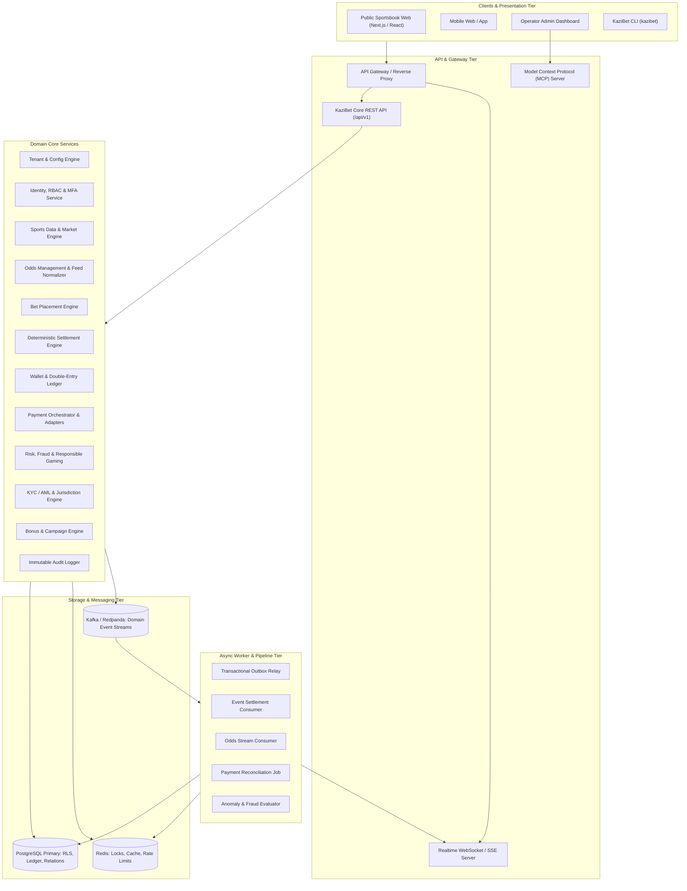
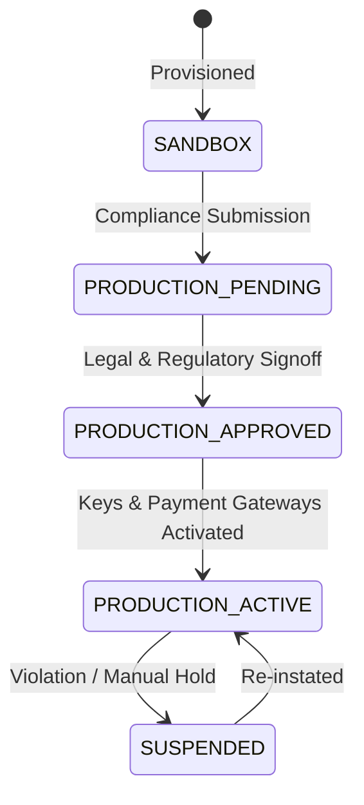

# KaziBet — Architecture & System Design

> **The open sportsbook infrastructure platform.**

---

## 1. Executive Summary & Vision

KaziBet is an open-source, production-grade, multi-tenant Sportsbook Platform OS designed for iGaming operators, platform aggregators, and white-label providers. It delivers enterprise-grade reliability, an immutable double-entry financial ledger, deterministic bet settlement, dynamic market odds management, modular payment adapters, and an integrated AI operations copilot.

KaziBet is **sandbox-first**: real-money wagering, live payment gateways, and real payouts are strictly gated behind an explicit capability state machine.

---

## 2. Core Design Principles

1. **Ledger as the Single Financial Source of Truth**: User balances are never represented by a single mutable column like `balance = balance + X`. All mutations flow through double-entry accounting entries where $\sum \text{Debits} = \sum \text{Credits}$.
2. **Deterministic & Replayable Settlement**: Bets are settled by pure functions taking the official event result and odds version snapshot. Corrections generate auditable compensating transactions.
3. **Strict Multi-Tenant Isolation**: Every database query, cache key, queue message, and API request is explicitly scoped to a `tenantId`.
4. **Idempotency & Concurrency Safety**: All financial and bet-placement operations accept an idempotency key (`Idempotency-Key` header) and utilize database serializable or row-level pessimistic locking (`SELECT FOR UPDATE`) to prevent double-spending and race conditions.
5. **Sandbox-First Capability Gate**: Every tenant operates in `SANDBOX` by default. Transitioning to `PRODUCTION_ACTIVE` requires automated validation of regulatory compliance, KYC/AML configuration, tax rules, and secret hygiene.
6. **Provider-Neutral Abstraction**: Sports feeds, odds, payments, notifications, and KYC are hidden behind strongly typed interfaces.
7. **AI with Human-in-the-Loop Safeguards**: AI and LLM agents can inspect risk signals and recommend actions via MCP tools, but cannot directly execute irreversible financial operations.

---

## 3. High-Level Architecture (C4 Model)



---

## 4. Subsystem Breakdown

### 4.1 Tenant & Capability State Machine

Tenants progress through five strictly enforced capability phases:



In `SANDBOX` mode:
- Virtual currencies (e.g. `KES_VIRTUAL`, `USD_VIRTUAL`) are provisioned.
- Payment adapters use deterministic mock engines simulating STK Push, Card 3DS, Bank Transfer.
- Sports feeds run via a local fixture generator or real-time match simulator.
- KYC is auto-approved with simulated pass/fail test cases.

### 4.2 Betting Engine & Bet Slip Validation Pipeline

```text
Incoming Bet Slip Request
  │
  ├─► 1. Authenticate user & verify session
  ├─► 2. Validate Tenant Context & Capability (Sandbox vs Prod)
  ├─► 3. Check Account Status (ACTIVE only; reject if SUSPENDED or SELF_EXCLUDED)
  ├─► 4. Validate Responsible Gaming Limits (Daily/Weekly/Monthly loss & stake limits)
  ├─► 5. Validate Selections (Odds freshness, market status != SUSPENDED, mutually exclusive legs)
  ├─► 6. Acquire Distributed Lock: lock(tenantId, walletId)
  ├─► 7. BEGIN DATABASE TRANSACTION (SERIALIZABLE or SELECT FOR UPDATE on Wallet)
  │      ├─ Check available balance >= stake
  │      ├─ Insert Bet record (PENDING) with immutable accepted odds
  │      ├─ Create Ledger Transaction:
  │      │    DEBIT:  User Available Account
  │      │    CREDIT: User Stake Hold Account
  │      ├─ Record Idempotency Key
  │      └─ Insert Outbox Event (BetPlaced)
  ├─► 8. COMMIT TRANSACTION
  ├─► 9. Release Lock
  └─► 10. Emit Realtime Notification via WebSocket
```

### 4.3 Ledger Architecture

All monetary mutations are recorded as balanced double-entry transactions:

$$\sum \text{Debit Amounts} = \sum \text{Credit Amounts}$$

Chart of Accounts:
1. `ASSET:PAYMENT_CLEARING` (External payment provider clearing)
2. `LIABILITY:USER_AVAILABLE` (User funds available for wagering or withdrawal)
3. `LIABILITY:USER_HOLD` (Held stakes for active unresolved bets)
4. `LIABILITY:BONUS_BALANCE` (Promotional wagering balance, isolated from cash)
5. `REVENUE:GROSS_GAMING_REVENUE` (GGR operator win)
6. `EXPENSE:GAMING_LOSS` (Operator payout on winning bets)
7. `LIABILITY:WITHHOLDING_TAX` (Tax withheld on net winnings payable to revenue authority)

---

## 5. Architectural Risks & Mitigations

| Risk | Impact | Mitigation Strategy |
| :--- | :--- | :--- |
| **Race conditions in bet placement (double-spend)** | High financial loss | Pessimistic row locking on wallet (`SELECT FOR UPDATE`) + Redis distributed lock + strict non-negative check constraint in PostgreSQL (`available_cents >= 0`). |
| **Silent real-money leak in sandbox** | Regulatory fine / catastrophic loss | Hard-coded capability checks in payment adapters; real gateway credentials rejected if status != `PRODUCTION_ACTIVE`. |
| **Cross-tenant data contamination** | Critical security/compliance breach | Row-Level Security (RLS) policies in PostgreSQL + mandatory `TenantContext` in API pipeline + automated cross-tenant integration test suite. |
| **Settlement discrepancies or duplicate payouts** | Severe financial loss | Deterministic state machine for Bet (`PLACED` -> `SETTLED`), unique constraint on `(bet_id, settlement_version)`, idempotent payouts via ledger holds. |
| **Delayed or manipulated odds feeds** | Arbitrage exploitation / latency gaming | Acceptance window verification; each bet slip submission checks odds version and timestamp against live book; slippage tolerance checks. |
| **Non-deterministic AI decisions** | Regulatory non-compliance | AI copilot has read-only access to investigate, generate audit summaries, and propose risk actions. Enforcement requires human-in-the-loop or deterministic rule engine. |
