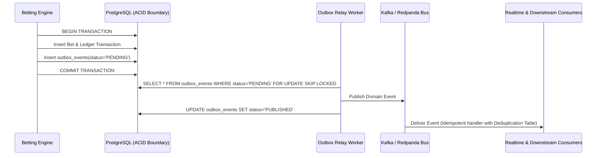

# KaziBet — Event-Driven Architecture & Domain Events

KaziBet uses a transactional outbox pattern to ensure guaranteed, at-least-once delivery of domain events without distributed transaction overhead.

---

## 1. Domain Event Catalog

| Event Name | Aggregate | Key Payload Fields |
| :--- | :--- | :--- |
| `TenantCreated` | Tenant | `tenantId`, `code`, `name`, `defaultCurrency` |
| `TenantCapabilityChanged` | Tenant | `tenantId`, `previousStatus`, `newStatus`, `reason` |
| `UserRegistered` | User | `tenantId`, `userId`, `phoneNumber`, `email` |
| `UserKycStatusChanged` | User | `tenantId`, `userId`, `previousTier`, `newTier`, `status` |
| `UserSelfExcluded` | User | `tenantId`, `userId`, `untilDate`, `reason` |
| `SportEventStarted` | Event | `tenantId`, `eventId`, `sportId`, `startTime` |
| `MarketOddsUpdated` | Market | `tenantId`, `eventId`, `marketId`, `oddsVersion`, `selections` |
| `MarketSuspended` | Market | `tenantId`, `marketId`, `reason` |
| `BetPlaced` | BetSlip | `tenantId`, `betSlipId`, `userId`, `stakeCents`, `potentialPayout` |
| `BetSettled` | Bet | `tenantId`, `betId`, `status`, `payoutCents`, `taxCents` |
| `DepositCompleted` | Payment | `tenantId`, `paymentId`, `userId`, `amountCents`, `provider` |
| `WithdrawalRequested` | Payment | `tenantId`, `withdrawalId`, `userId`, `amountCents` |
| `RiskSignalDetected` | RiskCase | `tenantId`, `userId`, `signalType`, `severity`, `score` |

---

## 2. Transactional Outbox Pattern

Consumers maintain a `processed_events` table indexed by `(tenant_id, event_id)` to guarantee idempotent execution despite at-least-once delivery semantics.
